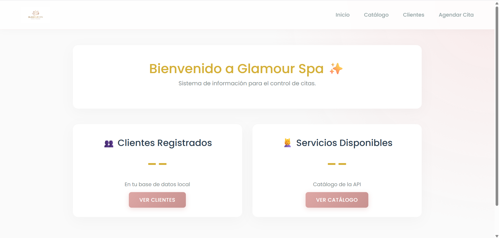
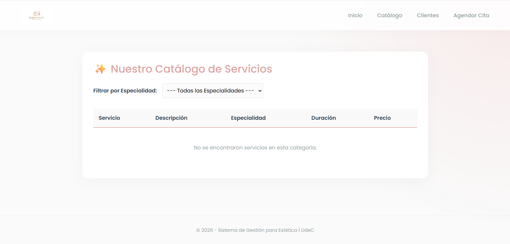
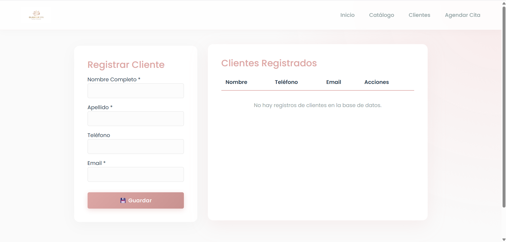
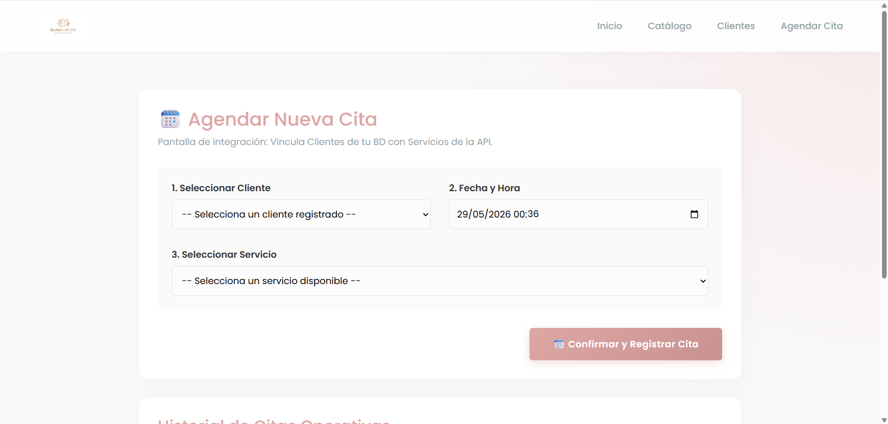

# Evidencia de Entrega - Proyecto 3a Evaluación Parcial
Link a github: https://github.com/Joshua18881/proyectoEstetica3raParcial/edit/main/README.md 

Este repositorio contiene el código fuente del Sistema de Información Web desarrollado en Blazor Server para la materia de **Programación para Web** (4° Semestre, Grupo E, Ingeniería de Software).

---
**Nombre Completo:** Joshua Adrián Aburto Beltrán
**Número de Cuenta:** 20216672
**Negocio Asignado:** Estética / Salón (Glamour Spa) 
**URL de la API Consumida:** `[https://api-udec-pweb.azurewebsites.net](https://api-udec-pweb-aedec9hxbugye0am.westus3-01.azurewebsites.net/api/salud/servicios)` 

---

## Capturas de Pantalla del Sistema

A continuación se anexan las 4 capturas de pantalla funcionales y navegables exigidas por el criterio de evaluación:

### 1. Pantalla 1: Inicio / Dashboard
*Identidad visual del negocio, logotipo transparente, acceso directo y al menos 2 indicadores con datos reales en tiempo real (BD local y API externa).*

### 2. Pantalla 2: Catálogo de Servicios
*Despliegue del catálogo consumido mediante HttpClient desde la API externa del profesor, incluyendo el filtro funcional por especialidad y el estado de carga ("Cargando catálogo...").*

### 3. Pantalla 3: Gestión de Clientes
*Módulo con el CRUD completo (Alta, Consulta, Edición y Eliminación con confirmación técnica) conectado directamente a Azure SQL Database.*

### 4. Pantalla 4: Registro de Operaciones (Integración)
*Formulario de agendamiento donde conviven los datos de la base de datos propia y el servicio seleccionado de la API externa, guardando de forma relacional el Id del servicio y el precio histórico en la tabla puente.*

---

## Declaratoria de Uso de IA
Uso del 40% de IA

* **Herramienta:** Google Gemini
* **Uso:** Optimización del diseño de la interfaz visual en CSS y creacion de base de datos.
* **Evidencia:** https://gemini.google.com/share/070155ab22f8
